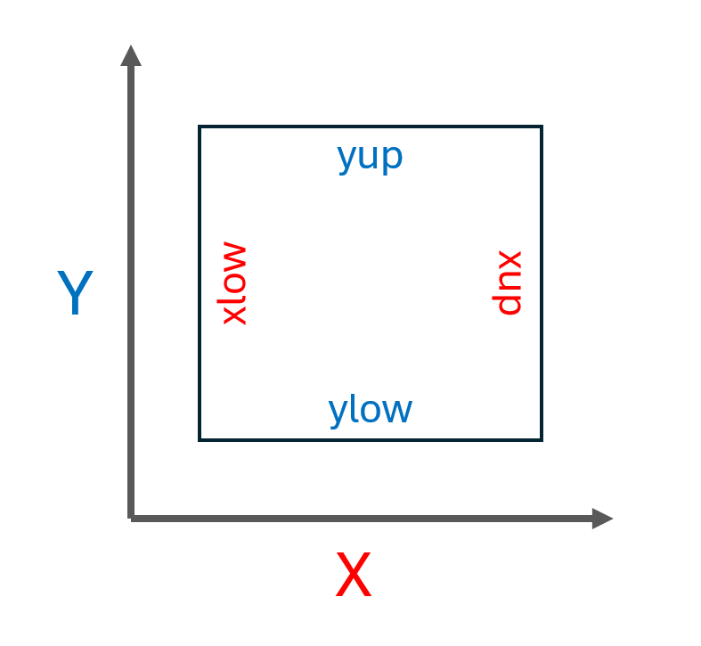

.. _sec-domain_grid:

Domain and gridding
===========

Domain conventions
--------------

Please see the `BOUT++ topology documentation <https://bout-dev.readthedocs.io/en/stable/user_docs/input_grids.html#bout-topology>`_ for 
a detailed guide to the topology and geometry conventions used in BOUT++ and Hermes-3. Detailed
information on the coordinate system can be found in the `BOUT++ field-aligned coordinates section <https://bout-dev.readthedocs.io/en/stable/user_docs/coordinates.html#field-aligned-coordinates>`_.

Guard cells
--------------

Hermes-3 calculates all evolved variables at cell centres. Values on the cell faces are calculated by 
interpolating in-between neighbouring cell centres. This means that to calculate the value a domain boundary cell face,
we must have a cell "beyond" the boundary cell. This is the "guard" cell, also called the "halo" or "ghost" cell.
Due to BOUT++ convention, each boundary features two guard cells. In Hermes-3, only the inner ones are used,
with the outer ones meant for higher-order boundary conditions not implemented in Hermes-3. 

The below figure shows the domain and guard cells. In most cases, the guard cells are the same size as the final
domain cell, allowing the boundary value to be calculated by taking a simple average of the values in the final 
domain cell and the guard cell centres.

.. figure:: figs/guard_cells.png
   :name: Guard cells
   :alt:
   :width: 60%

   Domain and guard cells. The outer guard cells are unused. The boundary value
   is calculated through interpolating between the final and inner guard cell centres.

.. _sec-cell-face-notation:

Cell face notation
--------------

While all evolved variables are solved at cell centres, values at cell boundaries are often needed to calculate 
fluxes. The cell face notation is as shown in the below figure, where "low" and "up" refer to the negative
and positive direction in index space, respectively. This notation is also used for diagnostics for values
at the boundaries, such as flows of particles, energy and momentum (see :ref:`sec-flow-diagnostics`). 

   Cell faces xlow, xup, ylow and yup.

Gridding
--------------
WIP

Hermes-3 can be configured using an analytically defined grid, see the
relevant `BOUT++ documentation <https://bout-dev.readthedocs.io/en/stable/user_docs/input_grids.html>`_. 
Tokamak geometry is currently generated by Hypnotoad, see the `GitHub repo <https://github.com/boutproject/hypnotoad>`_
and `documentation <https://hypnotoad.readthedocs.io/en/latest/>`_.

Grid redistribution and interpolation
~~~~~~~~~~~~~~

WIP

A useful strategy is to start with a low resolution grid, run until
close to steady-state, then interpolate the solution onto a finer mesh
and restart. This process can be repeated as a kind of simplified
multigrid method.

Using grids to pass inputs to Hermes-3
~~~~~~~~~~~~~~
WIP

Metric coefficients
~~~~~~~~~~~~~~

The option ``hermes:recalculate_metric`` controls how the metric tensor is calculated. 
By default ``recalculate_metric`` is ``false``, meaning that the metric tensor
components (``g11``, ``g_22`` etc.) are taken from the grid file.

Setting ``recalculate_metric`` to ``true`` causes Hermes-3 to read
``Rxy``, ``Bpxy`` and other geometric quantities from the grid file.
The metric tensor is recalculated to the orthogonal field-aligned
coordinate system described in the `BOUT++ coordinate manual
<https://bout-dev.readthedocs.io/en/stable/user_docs/coordinates.html#jacobian-and-metric-tensors>`_.

**Note** Previous Hermes-3 versions had an option ``loadmetric`` with
the same behavior but the opposite default (``loadmetric=false``
rather than ``recalculate_metric=true``).

If ``hermes:recalculate_metric`` is false (the default), then the coordinate
metrics loaded from the grid file are usually in SI units.  By default
``normalise_metric`` is ``true``, and the loaded metrics are
normalised using the Hermes-3 normalisation factors.

If ``recalculate_metric`` is set to ``true`` then the metrics will always
be normalised, and the ``normalise_metric`` option is not used.
The default BOUT++ behavior is to throw an exception if an option is
set but not used.

